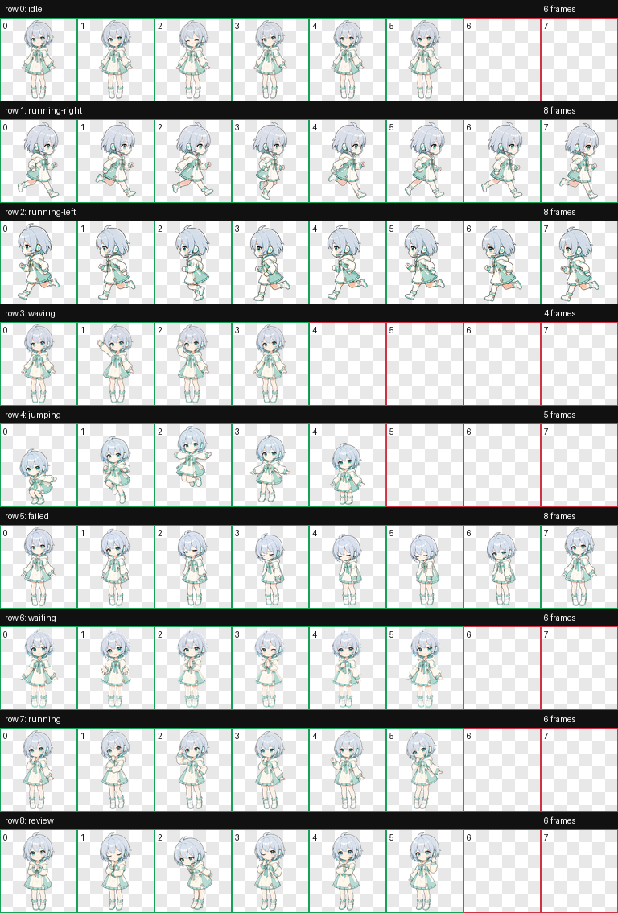

# 小澄·薄荷助手

一个适用于 ChatGPT Codex Pets 的二次元少女动画宠物。小澄采用银蓝短发、青绿色眼睛、奶油白与薄荷青连帽裙和左耳单侧耳麦设计，包含 Codex 所需的全部九种动画状态。



## 特点

- 完整 `1536×1872` WebP 透明图集，8 列 × 9 行，每格 `192×208`。
- 包含待机、左右移动、挥手、跳跃、失败、等待输入、工作中和审查等九种状态。
- 提供 Windows 一键安装与安全卸载脚本。
- 公开基准图、生成提示词、动画预览和脱敏 QA 结果。
- 中文文档优先；Codex 固定字段、动画状态名和许可证原文保留英文。

## 快速安装

```powershell
git clone https://github.com/fichil/xiaocheng-codex-pet.git
Set-Location .\xiaocheng-codex-pet
powershell -ExecutionPolicy Bypass -File .\scripts\install.ps1
```

安装完成后，在 ChatGPT 桌面端打开 **Settings → Pets**，点击 **Refresh**，然后选择“小澄·薄荷助手”。

如需覆盖已安装的同名小澄宠物：

```powershell
powershell -ExecutionPolicy Bypass -File .\scripts\install.ps1 -Force
```

自定义 Codex 目录、手动安装和卸载方法见[安装与使用](docs/安装与使用.md)。

## 动画状态

| 行 | 状态 | 帧数 | 用途 |
| ---: | --- | ---: | --- |
| 0 | `idle` | 6 | 安静呼吸与眨眼 |
| 1 | `running-right` | 8 | 向右移动 |
| 2 | `running-left` | 8 | 向左移动，保持左耳耳麦 |
| 3 | `waving` | 4 | 挥手问候 |
| 4 | `jumping` | 5 | 预备、起跳、顶点、下降、落稳 |
| 5 | `failed` | 8 | 失败或受阻反应 |
| 6 | `waiting` | 6 | 等待用户确认或输入 |
| 7 | `running` | 6 | 正在处理任务，不是跑步 |
| 8 | `review` | 6 | 专注审查结果 |

## 项目结构

- `pet/`：可以直接安装到 Codex 的 `pet.json` 与 `spritesheet.webp`。
- `assets/`：透明基准图与九状态联系表。
- `previews/`：每种状态的 GIF 动画预览。
- `source/`：角色配置、基准参考、生成提示词和脱敏 QA 记录。
- `scripts/`：安装与卸载脚本。
- `docs/`：中文安装、制作和验证说明。

## 验证结果

- 图集尺寸、格式、透明通道和全部使用/未使用单格符合 Codex Pets 固定契约。
- 透明像素 RGB 残留为 0。
- 九个状态均通过独立视觉 QA：身份、左耳耳麦、方向、步态、尺寸和循环一致。
- 生成过程使用软键控遮罩、去品红色溢、1 像素边缘收缩和 `stable-slots` 抽帧。

详细过程见[制作与验证](docs/制作与验证.md)。

## 开源许可

- `scripts/` 和工程配置： [MIT License](LICENSE)。
- 角色图、动画、宠物包、生成资料及中文文档： [Creative Commons Attribution 4.0 International](LICENSE-ASSETS)。

转载或修改美术内容时，请保留署名：`小澄·薄荷助手 by fichil`，并链接到本仓库。具体范围见 [NOTICE.md](NOTICE.md)。

## AI 辅助与免责声明

角色原画和动作素材由 OpenAI Codex 的图像生成能力辅助创作，并通过确定性工具完成透明化、抽帧、图集合成和验证。本项目为社区作品，与 OpenAI、ChatGPT 或 Codex 官方无隶属、赞助或背书关系。
