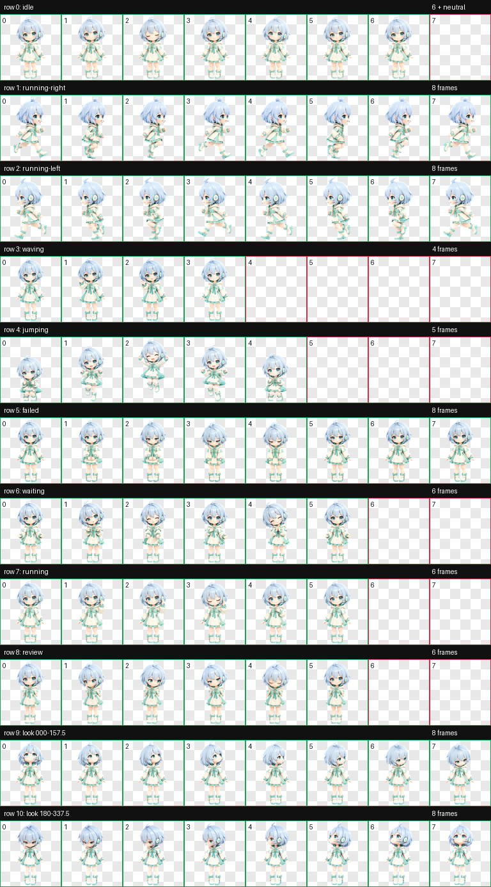

# 小澄·薄荷助手

一个适用于 Codex Pets 的 V2 动画桌宠。新版采用柔和 3D 手办风格：银蓝短发、青绿色眼睛、奶油白与薄荷连帽裙，搭配固定在角色左耳的单侧耳麦。小澄平时安静陪伴，通过眼神、小表情和轻柔动作回应任务状态。



## 新版变化

- 约三头身的哑光手办质感，柔和体积光与简洁的发束、衣褶，便于在小尺寸下识别。
- 九种标准动作全部重新生成；等待输入采用摊手邀请，工作中轻触耳麦思考，审查时双手背后并观察结果。
- 左右移动分别制作，保持角色左耳耳麦的近侧显示和远侧遮挡。
- 16 个观察方向通过眼球、眼睑和头颈配合表达，脚底和下身保持稳定。
- 使用整行动作共享尺度抽帧，保留跳跃高度，避免蹲下或低头时被单独放大。

## 快速安装

```powershell
git clone https://github.com/fichil/xiaocheng-codex-pet.git
Set-Location .\xiaocheng-codex-pet
powershell -ExecutionPolicy Bypass -File .\scripts\install.ps1
```

安装完成后，在桌面端打开 **Settings → Pets**，点击 **Refresh**，选择“小澄·薄荷助手”。覆盖已有同名宠物时使用 `-Force`；覆盖前建议保存原来的 `pet.json` 和 `spritesheet.webp`。

```powershell
powershell -ExecutionPolicy Bypass -File .\scripts\install.ps1 -Force
```

自定义目录、手动安装和卸载方法见[安装与使用](docs/安装与使用.md)。

[Codex Pets 社区详情页](https://codex-pets.net/#/pets/xiaocheng)提供另一下载渠道。本仓库的 3D 升级不会自动更新社区站下载包；社区包可能仍是先前的二次元版本，以实际预览和文件为准。

## 动画预览

| 待机 | 工作中 | 跳跃 |
| --- | --- | --- |
|  |  |  |

[完整十种动画预览](previews/README.md)与[浅深背景预览页面](previews/index.html)位于 `previews/`，观察方向检查图位于 `assets/look-directions.png`。

## V2 格式与状态

透明 WebP 图集为 `1536×2288`，8 列 × 11 行，单格 `192×208`；`spriteVersionNumber` 保持为 `2`。

| 行（从 0 开始） | 状态 | 动画帧数 |
| ---: | --- | ---: |
| 0 | `idle` 安静待机 | 6 |
| 1、2 | `running-right` / `running-left` 左右移动 | 各 8 |
| 3 | `waving` 挥手 | 4 |
| 4 | `jumping` 跳跃 | 5 |
| 5 | `failed` 失败反应 | 8 |
| 6 | `waiting` 等待输入 | 6 |
| 7 | `running` 任务处理中 | 6 |
| 8 | `review` 审查 | 6 |
| 9、10 | 16 个顺时针观察方向 | 各 8 |

第 0 行第 6 列另存中性姿态，不计入六帧待机循环；其他未使用单格完全透明。`000` 表示向上，`090` 向屏幕右，`180` 向下，`270` 向屏幕左。

## 制作资料与验证

- `pet/`：可安装的清单与图集。
- `assets/`、`previews/`：角色基准、联系表、方向检查图和动画预览。
- `source/`：3D 角色配置、生成提示词、统一身份参考及脱敏 QA 记录。
- `scripts/`、`docs/`：安装卸载脚本与中文说明。

验证覆盖图集尺寸、透明度、使用格与中性姿态、动作语义、单侧耳麦、观察方向盲测和连续性；结果通过 SHA256 绑定当前图集。用户已于 2026-09-14 确认切换成功，确认来源与代理视觉验收分别记录。生成式素材不能保证再次运行得到逐像素相同结果。详见[制作与验证](docs/制作与验证.md)。

## 开源许可

- `scripts/` 和工程配置：[MIT License](LICENSE)。
- 角色图、动画、宠物包、生成资料及中文文档：[CC BY 4.0](LICENSE-ASSETS)。

转载或修改美术内容时，请保留署名“小澄·薄荷助手 by fichil”并链接本仓库，具体范围见 [NOTICE.md](NOTICE.md)。

角色与动作由 OpenAI Codex 的图像生成能力辅助创作，确定性工具负责透明化、抽帧、合成与验证。本项目为社区作品，与 OpenAI、ChatGPT 或 Codex 官方无隶属、赞助或背书关系。
